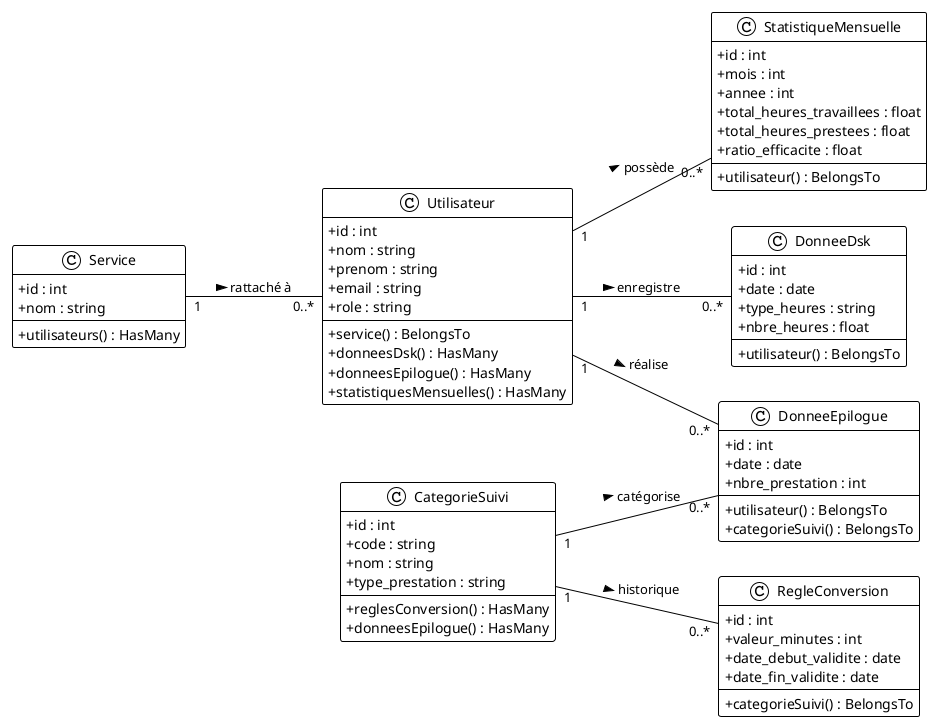

```plantuml
@startuml
!theme plain
skinparam classAttributeIconSize 0
left to right direction

class Service {
    + id : int
    + nom : string
    + utilisateurs() : HasMany
}

class Utilisateur {
    + id : int
    + nom : string
    + prenom : string
    + email : string
    + role : string
    + service() : BelongsTo
    + donneesDsk() : HasMany
    + donneesEpilogue() : HasMany
    + statistiquesMensuelles() : HasMany
}

class CategorieSuivi {
    + id : int
    + code : string
    + nom : string
    + type_prestation : string
    + reglesConversion() : HasMany
    + donneesEpilogue() : HasMany
}

class RegleConversion {
    + id : int
    + valeur_minutes : int
    + date_debut_validite : date
    + date_fin_validite : date
    + categorieSuivi() : BelongsTo
}

class DonneeDsk {
    + id : int
    + date : date
    + type_heures : string
    + nbre_heures : float
    + utilisateur() : BelongsTo
}

class DonneeEpilogue {
    + id : int
    + date : date
    + nbre_prestation : int
    + utilisateur() : BelongsTo
    + categorieSuivi() : BelongsTo
}

class StatistiqueMensuelle {
    + id : int
    + mois : int
    + annee : int
    + total_heures_travaillees : float
    + total_heures_prestees : float
    + ratio_efficacite : float
    + utilisateur() : BelongsTo
}

' --- Relations et Multiplicités ---
Service "1" -- "0..*" Utilisateur : rattaché à >
Utilisateur "1" -- "0..*" DonneeDsk : enregistre >
Utilisateur "1" -- "0..*" DonneeEpilogue : réalise >
Utilisateur "1" -- "0..*" StatistiqueMensuelle : possède >
CategorieSuivi "1" -- "0..*" RegleConversion : historique >
CategorieSuivi "1" -- "0..*" DonneeEpilogue : catégorise >

@enduml
```