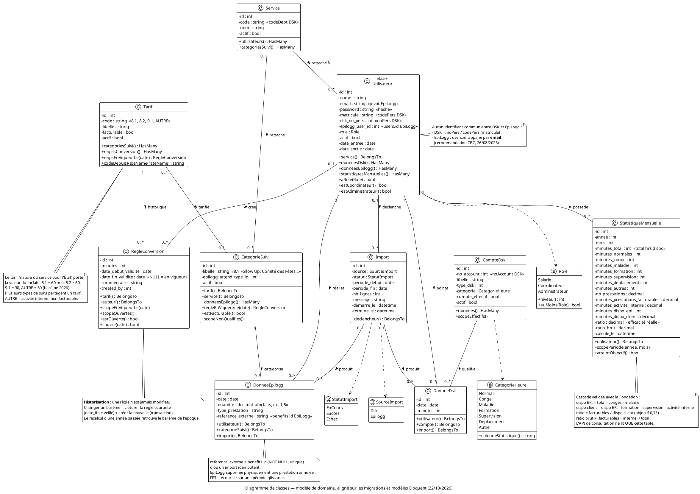

```plantuml
@startuml
!theme plain
skinparam classAttributeIconSize 0

caption Diagramme de classes — modèle de domaine, aligné sur les migrations et modèles Eloquent (22/10/2026)

' ============================================================
'  Énumérations (App\Enums) — castées automatiquement par Eloquent
' ============================================================
enum Role {
    Salarie
    Coordinateur
    Administrateur
    + niveau() : int
    + auMoins(Role) : bool
}

enum CategorieHeure {
    Normal
    Conge
    Maladie
    Formation
    Supervision
    Deplacement
    Autre
    + colonneStatistique() : string
}

enum SourceImport {
    Dsk
    Epilogg
}

enum StatutImport {
    EnCours
    Succes
    Echec
}

' ============================================================
'  Organigramme et utilisateurs
' ============================================================
class Service {
    - id : int
    - code : string  <<codeDept DSK>>
    - nom : string
    - actif : bool
    + utilisateurs() : HasMany
    + categoriesSuivi() : HasMany
}

class Utilisateur <<User>> {
    - id : int
    - name : string
    - email : string  <<pivot EpiLogg>>
    - password : string  <<hashé>>
    - matricule : string  <<codePers DSK>>
    - dsk_no_pers : int  <<noPers DSK>>
    - epilogg_user_id : int  <<users.id EpiLogg>>
    - role : Role
    - actif : bool
    - date_entree : date
    - date_sortie : date
    + service() : BelongsTo
    + donneesDsk() : HasMany
    + donneesEpilogg() : HasMany
    + statistiquesMensuelles() : HasMany
    + aRole(Role) : bool
    + estCoordinateur() : bool
    + estAdministrateur() : bool
}

' ============================================================
'  Référentiels : tarifs, types de suivi EpiLogg, compteurs DSK
' ============================================================
class Tarif {
    - id : int
    - code : string  <<8.1, 8.2, 9.1, AUTRE>>
    - libelle : string
    - facturable : bool
    - actif : bool
    + categoriesSuivi() : HasMany
    + reglesConversion() : HasMany
    + regleEnVigueurLe(date) : RegleConversion
    + {static} codeDepuisRateName(rateName) : string
}

class CategorieSuivi {
    - id : int
    - libelle : string  <<8.1 Follow Up, Comité des Fêtes…>>
    - epilogg_attend_type_id : int
    - actif : bool
    + tarif() : BelongsTo
    + service() : BelongsTo
    + donneesEpilogg() : HasMany
    + regleEnVigueurLe(date) : RegleConversion
    + estFacturable() : bool
    + scopeNonQualifies()
}

class RegleConversion {
    - id : int
    - minutes : int
    - date_debut_validite : date
    - date_fin_validite : date  <<NULL = en vigueur>>
    - commentaire : string
    - created_by : int
    + tarif() : BelongsTo
    + auteur() : BelongsTo
    + scopeEnVigueurLe(date)
    + scopeOuvertes()
    + estOuverte() : bool
    + couvre(date) : bool
}

class CompteDsk {
    - id : int
    - no_account : int  <<noAccount DSK>>
    - libelle : string
    - type_dsk : int
    - categorie : CategorieHeure
    - compte_effectif : bool
    - actif : bool
    + donnees() : HasMany
    + scopeEffectifs()
}

' ============================================================
'  Flux bruts importés (lecture seule des sources)
' ============================================================
class Import {
    - id : int
    - source : SourceImport
    - statut : StatutImport
    - periode_debut : date
    - periode_fin : date
    - nb_lignes : int
    - message : string
    - demarre_le : datetime
    - termine_le : datetime
    + declencheur() : BelongsTo
}

class DonneeDsk {
    - id : int
    - date : date
    - minutes : int
    + utilisateur() : BelongsTo
    + compte() : BelongsTo
    + import() : BelongsTo
}

class DonneeEpilogg {
    - id : int
    - date : date
    - quantite : decimal  <<forfaits, ex. 1,5>>
    - type_prestation : string
    - reference_externe : string  <<benefits.id EpiLogg>>
    + utilisateur() : BelongsTo
    + categorieSuivi() : BelongsTo
    + import() : BelongsTo
}

' ============================================================
'  Cache consolidé lu par l'API de consultation
' ============================================================
class StatistiqueMensuelle {
    - id : int
    - annee : int
    - mois : int
    - minutes_total : int  <<total hrs dispo>>
    - minutes_normales : int
    - minutes_conge : int
    - minutes_maladie : int
    - minutes_formation : int
    - minutes_supervision : int
    - minutes_deplacement : int
    - minutes_autres : int
    - nb_prestations : decimal
    - minutes_prestations_facturables : decimal
    - minutes_activite_interne : decimal
    - minutes_dispo_epi : int
    - minutes_dispo_client : decimal
    - ratio : decimal  <<efficacité réelle>>
    - ratio_brut : decimal
    - calcule_le : datetime
    + utilisateur() : BelongsTo
    + scopePeriode(annee, mois)
    + atteintObjectif() : bool
}

' ============================================================
'  Relations et multiplicités
' ============================================================
Service "1" -- "0..*" Utilisateur : rattaché à >
Service "0..1" -- "0..*" CategorieSuivi : rattache >

Utilisateur "1" -- "0..*" DonneeDsk : pointe >
Utilisateur "1" -- "0..*" DonneeEpilogg : réalise >
Utilisateur "1" -- "0..*" StatistiqueMensuelle : possède >
Utilisateur "0..1" -- "0..*" RegleConversion : crée >
Utilisateur "0..1" -- "0..*" Import : déclenche >

Tarif "0..1" -- "0..*" CategorieSuivi : tarifie >
Tarif "1" -- "0..*" RegleConversion : historique >

CategorieSuivi "1" -- "0..*" DonneeEpilogg : catégorise >

CompteDsk "1" -- "0..*" DonneeDsk : qualifie >

Import "0..1" -- "0..*" DonneeDsk : produit >
Import "0..1" -- "0..*" DonneeEpilogg : produit >

Utilisateur ..> Role
CompteDsk ..> CategorieHeure
Import ..> SourceImport
Import ..> StatutImport

' ============================================================
'  Notes de conception
' ============================================================
note right of Utilisateur
  Aucun identifiant commun entre DSK et EpiLogg :
  - DSK   : noPers / codePers (matricule)
  - EpiLogg : users.id, apparié par **email**
    (recommandation CBC, 26/08/2026)
end note

note bottom of Tarif
  Le tarif (nature du service pour l'État) porte
  la valeur du forfait : 8.1 = 60 min, 8.2 = 60,
  9.1 = 30, AUTRE = 60 (barème 2026).
  Plusieurs types de suivi partagent un tarif.
  AUTRE = activité interne, non facturable.
end note

note bottom of RegleConversion
  **Historisation** : une règle n'est jamais modifiée.
  Changer un barème = clôturer la règle courante
  (date_fin = veille) + créer la nouvelle (transaction).
  Le recalcul d'une année passée retrouve le barème de l'époque.
end note

note bottom of DonneeEpilogg
  reference_externe = benefits.id (NOT NULL, unique),
  d'où un import idempotent.
  EpiLogg supprime physiquement une prestation annulée :
  l'ETL réconcilie sur une période glissante.
end note

note bottom of StatistiqueMensuelle
  Cascade validée avec la Fondation :
  dispo EPI = total - congés - maladie
  dispo client = dispo EPI - formation - supervision - activité interne
  ratio = facturables / dispo client (objectif 0,75)
  ratio brut = (facturables + interne) / total
  L'API de consultation ne lit QUE cette table.
end note

@enduml
```
