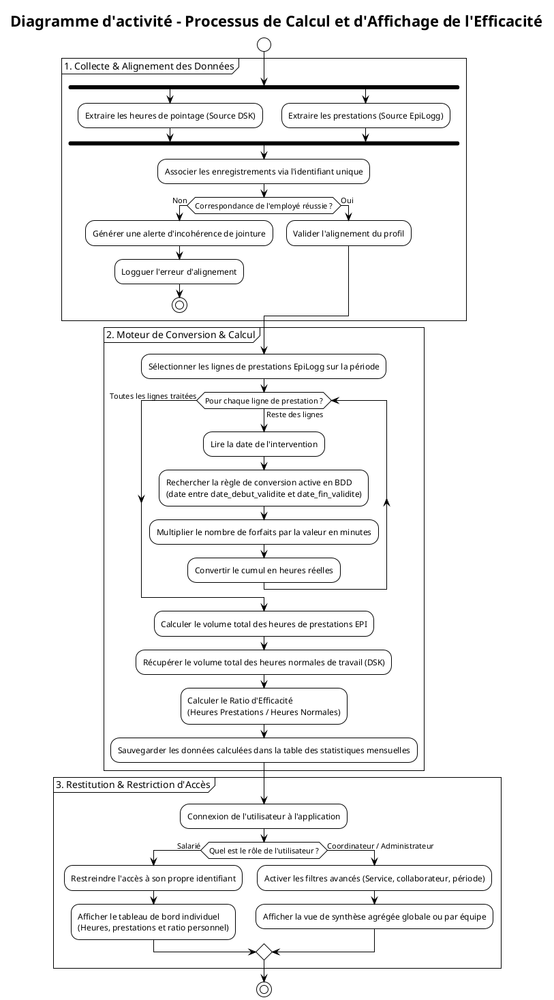

```plantuml
@startuml
!theme plain
title Diagramme d'activité - Processus de Calcul et d'Affichage de l'Efficacité

start

partition "1. Collecte & Alignement des Données" {
    fork
        :Extraire les heures de pointage (Source DSK);
    fork again
        :Extraire les prestations (Source EpiLogg);
    end fork

    :Associer les enregistrements via l'identifiant unique;
    
    if (Correspondance de l'employé réussie ?) then (Non)
        :Générer une alerte d'incohérence de jointure;
        :Logguer l'erreur d'alignement;
        stop
    else (Oui)
        :Valider l'alignement du profil;
    endif
}

partition "2. Moteur de Conversion & Calcul" {
    :Sélectionner les lignes de prestations EpiLogg sur la période;
    
    while (Pour chaque ligne de prestation ?) is (Reste des lignes)
        :Lire la date de l'intervention;
        :Rechercher la règle de conversion active en BDD\n(date entre date_debut_validite et date_fin_validite);
        :Multiplier le nombre de forfaits par la valeur en minutes;
        :Convertir le cumul en heures réelles;
    endwhile (Toutes les lignes traitées)

    :Calculer le volume total des heures de prestations EPI;
    :Récupérer le volume total des heures normales de travail (DSK);
    
    :Calculer le Ratio d'Efficacité\n(Heures Prestations / Heures Normales);
    :Sauvegarder les données calculées dans la table des statistiques mensuelles;
}

partition "3. Restitution & Restriction d'Accès" {
    :Connexion de l'utilisateur à l'application;
    
    if (Quel est le rôle de l'utilisateur ?) then (Salarié)
        :Restreindre l'accès à son propre identifiant;
        :Afficher le tableau de bord individuel\n(Heures, prestations et ratio personnel);
    else (Coordinateur / Administrateur)
        :Activer les filtres avancés (Service, collaborateur, période);
        :Afficher la vue de synthèse agrégée globale ou par équipe;
    endif
}

stop
@enduml
```
