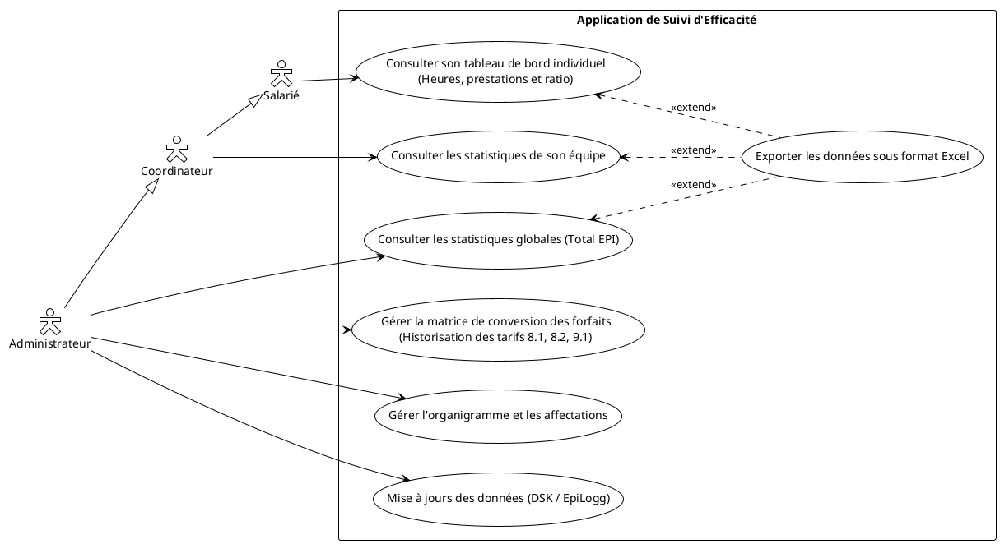

```plantuml
@startuml
!theme plain
left to right direction
skinparam packageStyle rectangle
skinparam actorStyle hollow

' --- Acteurs ---
actor "Salarié" as sal
actor "Coordinateur" as coord
actor "Administrateur" as admin

' --- Héritage des rôles ---
coord --|> sal
admin --|> coord

' --- Système ---
rectangle "Application de Suivi d'Efficacité" {
    
    ' Cas d'utilisation - Consultation
    usecase "Consulter son tableau de bord individuel\n(Heures, prestations et ratio)" as UC_dashboard
    usecase "Consulter les statistiques de son équipe" as UC_team_stats
    usecase "Consulter les statistiques globales (Total EPI)" as UC_global_stats
    
    ' Cas d'utilisation - Actions & Paramétrage
    usecase "Exporter les données sous format Excel" as UC_export
    usecase "Gérer la matrice de conversion des forfaits\n(Historisation des tarifs 8.1, 8.2, 9.1)" as UC_matrix
    usecase "Gérer l'organigramme et les affectations" as UC_organigramme
    usecase "Mise à jours des données (DSK / EpiLogg)" as UC_import
    
    ' Relations d'extension pour l'export Excel
    UC_dashboard <.. UC_export : <<extend>>
    UC_team_stats <.. UC_export : <<extend>>
    UC_global_stats <.. UC_export : <<extend>>
}

' --- Liaisons Acteurs -> Cas d'utilisation ---
sal --> UC_dashboard
coord --> UC_team_stats
admin --> UC_global_stats
admin --> UC_matrix
admin --> UC_organigramme
admin --> UC_import

@enduml
```
