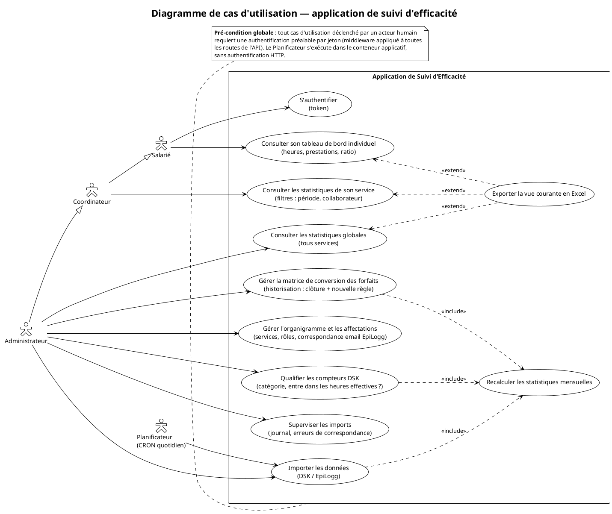

```plantuml
@startuml
!theme plain
left to right direction
skinparam packageStyle rectangle
skinparam actorStyle hollow

title Diagramme de cas d'utilisation — application de suivi d'efficacité

' --- Acteurs humains ---
actor "Salarié" as sal
actor "Coordinateur" as coord
actor "Administrateur" as admin

' --- Acteur technique ---
actor "Planificateur\n(CRON quotidien)" as cron

' --- Héritage des rôles ---
coord --|> sal
admin --|> coord

' --- Système ---
rectangle "Application de Suivi d'Efficacité" as app {

    ' Authentification (commune à tous)
    usecase "S'authentifier\n(token)" as UC_login

    ' Consultation
    usecase "Consulter son tableau de bord individuel\n(heures, prestations, ratio)" as UC_dashboard
    usecase "Consulter les statistiques de son service\n(filtres : période, collaborateur)" as UC_team_stats
    usecase "Consulter les statistiques globales\n(tous services)" as UC_global_stats
    usecase "Exporter la vue courante en Excel" as UC_export

    ' Paramétrage (Administrateur)
    usecase "Gérer la matrice de conversion des forfaits\n(historisation : clôture + nouvelle règle)" as UC_matrix
    usecase "Gérer l'organigramme et les affectations\n(services, rôles, correspondance email EpiLogg)" as UC_organigramme
    usecase "Qualifier les compteurs DSK\n(catégorie, entre dans les heures effectives ?)" as UC_comptes

    ' Import et supervision
    usecase "Importer les données\n(DSK / EpiLogg)" as UC_import
    usecase "Recalculer les statistiques mensuelles" as UC_recalc
    usecase "Superviser les imports\n(journal, erreurs de correspondance)" as UC_supervision

    ' Relations
    UC_dashboard <.. UC_export : <<extend>>
    UC_team_stats <.. UC_export : <<extend>>
    UC_global_stats <.. UC_export : <<extend>>

    UC_import ..> UC_recalc : <<include>>
    UC_matrix ..> UC_recalc : <<include>>
    UC_comptes ..> UC_recalc : <<include>>
}

note bottom of app
  **Pré-condition globale** : tout cas d'utilisation déclenché par un acteur humain
  requiert une authentification préalable par jeton (middleware appliqué à toutes
  les routes de l'API). Le Planificateur s'exécute dans le conteneur applicatif,
  sans authentification HTTP.
end note

' --- Liaisons acteurs -> cas d'utilisation ---
sal --> UC_login
sal --> UC_dashboard
coord --> UC_team_stats
admin --> UC_global_stats
admin --> UC_matrix
admin --> UC_organigramme
admin --> UC_comptes
admin --> UC_import
admin --> UC_supervision
cron --> UC_import

@enduml
```
