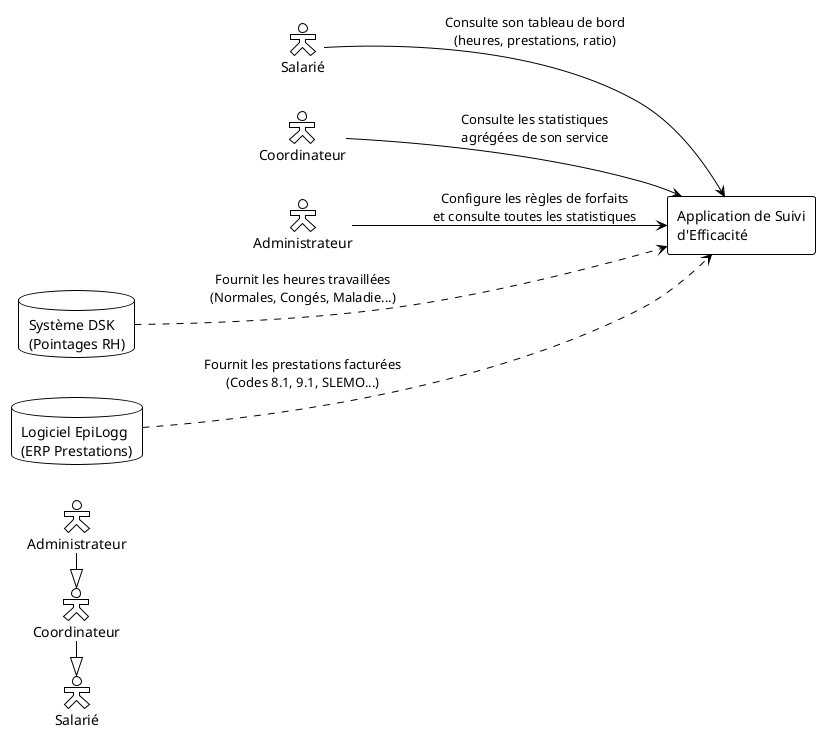

```plantuml
@startuml
!theme plain
left to right direction
skinparam packageStyle rectangle
skinparam actorStyle hollow

' --- Acteurs Humains ---
actor "Salarié" as sal
actor "Coordinateur" as coord
actor "Administrateur" as admin

' Déclaration de l'héritage
Coordinateur -|> Salarié
Administrateur -|> Coordinateur

' --- Systèmes Externes ---
database "Système DSK\n(Pointages RH)" as dsk
database "Logiciel EpiLogg\n(ERP Prestations)" as epilogg

' --- Le Système Principal ---
rectangle "Application de Suivi\nd'Efficacité" as app {
}

' --- Interactions Acteurs <-> Système ---
sal --> app : Consulte son tableau de bord\n(heures, prestations, ratio)
coord --> app : Consulte les statistiques\nagrégées de son service
admin --> app : Configure les règles de forfaits\net consulte toutes les statistiques

' --- Interactions Systèmes <-> Système ---
dsk ...> app : Fournit les heures travaillées\n(Normales, Congés, Maladie...)
epilogg ...> app : Fournit les prestations facturées\n(Codes 8.1, 9.1, SLEMO...)

@enduml
``` 
