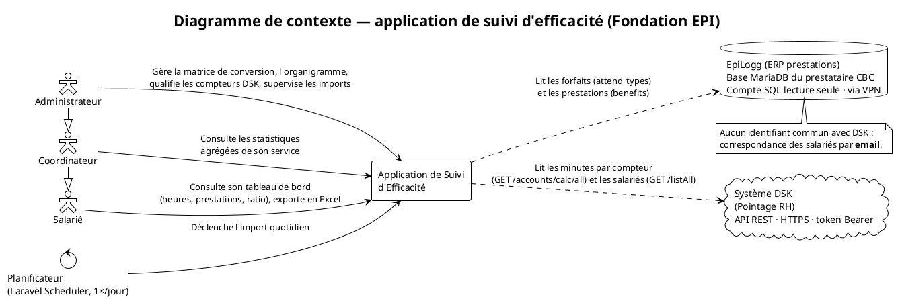

```plantuml
@startuml
!theme plain
left to right direction
skinparam packageStyle rectangle
skinparam actorStyle hollow

title Diagramme de contexte — application de suivi d'efficacité (Fondation EPI)

' --- Acteurs humains ---
actor "Salarié" as sal
actor "Coordinateur" as coord
actor "Administrateur" as admin

' Héritage de droits
coord -|> sal
admin -|> coord

' --- Acteur technique ---
control "Planificateur\n(Laravel Scheduler, 1×/jour)" as cron

' --- Systèmes externes (LECTURE SEULE) ---
cloud "Système DSK\n(Pointage RH)\nAPI REST · HTTPS · token Bearer" as dsk
database "EpiLogg (ERP prestations)\nBase MariaDB du prestataire CBC\nCompte SQL lecture seule · via VPN" as epilogg

' --- Le système ---
rectangle "Application de Suivi\nd'Efficacité" as app {
}

' --- Interactions acteurs <-> système ---
sal --> app : Consulte son tableau de bord\n(heures, prestations, ratio), exporte en Excel
coord --> app : Consulte les statistiques\nagrégées de son service
admin --> app : Gère la matrice de conversion, l'organigramme,\nqualifie les compteurs DSK, supervise les imports
cron --> app : Déclenche l'import quotidien

' --- Interactions système <-> systèmes externes ---
app ..> dsk : Lit les minutes par compteur\n(GET /accounts/calc/all) et les salariés (GET /listAll)
app ..> epilogg : Lit les forfaits (attend_types)\net les prestations (benefits)

note bottom of epilogg
  Aucun identifiant commun avec DSK :
  correspondance des salariés par **email**.
end note

@enduml
```
