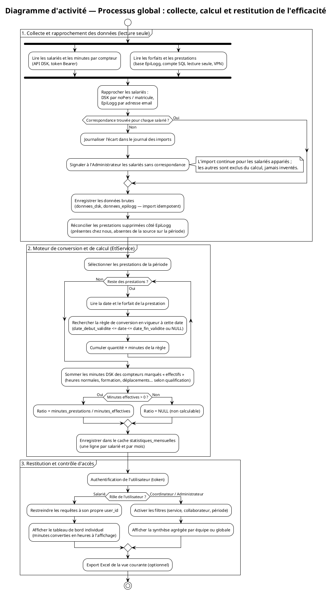

```plantuml
@startuml
!theme plain
title Diagramme d'activité — Processus global : collecte, calcul et restitution de l'efficacité

start

partition "1. Collecte et rapprochement des données (lecture seule)" {
    fork
        :Lire les salariés et les minutes par compteur\n(API DSK, token Bearer);
    fork again
        :Lire les forfaits et les prestations\n(base EpiLogg, compte SQL lecture seule, VPN);
    end fork

    :Rapprocher les salariés :\nDSK par noPers / matricule,\nEpiLogg par adresse email;

    if (Correspondance trouvée pour chaque salarié ?) then (Non)
        :Journaliser l'écart dans le journal des imports;
        :Signaler à l'Administrateur les salariés sans correspondance;
        note right
          L'import continue pour les salariés appariés ;
          les autres sont exclus du calcul, jamais inventés.
        end note
    else (Oui)
    endif

    :Enregistrer les données brutes\n(donnees_dsk, donnees_epilogg — import idempotent);
    :Réconcilier les prestations supprimées côté EpiLogg\n(présentes chez nous, absentes de la source sur la période);
}

partition "2. Moteur de conversion et de calcul (EtlService)" {
    :Sélectionner les prestations de la période;

    while (Reste des prestations ?) is (Oui)
        :Lire la date et le forfait de la prestation;
        :Rechercher la règle de conversion en vigueur à cette date\n(date_debut_validite <= date <= date_fin_validite ou NULL);
        :Cumuler quantité × minutes de la règle;
    endwhile (Non)

    :Sommer les minutes DSK des compteurs marqués « effectifs »\n(heures normales, formation, déplacements… selon qualification);

    if (Minutes effectives > 0 ?) then (Oui)
        :Ratio = minutes_prestations / minutes_effectives;
    else (Non)
        :Ratio = NULL (non calculable);
    endif

    :Enregistrer dans le cache statistiques_mensuelles\n(une ligne par salarié et par mois);
}

partition "3. Restitution et contrôle d'accès" {
    :Authentification de l'utilisateur (token);

    if (Rôle de l'utilisateur ?) then (Salarié)
        :Restreindre les requêtes à son propre user_id;
        :Afficher le tableau de bord individuel\n(minutes converties en heures à l'affichage);
    else (Coordinateur / Administrateur)
        :Activer les filtres (service, collaborateur, période);
        :Afficher la synthèse agrégée par équipe ou globale;
    endif

    :Export Excel de la vue courante (optionnel);
}

stop
@enduml
```
