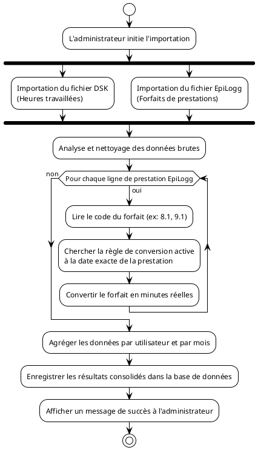

```plantuml
@startuml
!theme plain
skinparam activityShape roundBox

start
:L'administrateur initie l'importation;
fork
  :Importation du fichier DSK\n(Heures travaillées);
fork again
  :Importation du fichier EpiLogg\n(Forfaits de prestations);
end fork

:Analyse et nettoyage des données brutes;

while (Pour chaque ligne de prestation EpiLogg) is (oui)
  :Lire le code du forfait (ex: 8.1, 9.1);
  :Chercher la règle de conversion active\nà la date exacte de la prestation;
  :Convertir le forfait en minutes réelles;
endwhile (non)

:Agréger les données par utilisateur et par mois;
:Enregistrer les résultats consolidés dans la base de données;
:Afficher un message de succès à l'administrateur;

stop
@enduml
```
