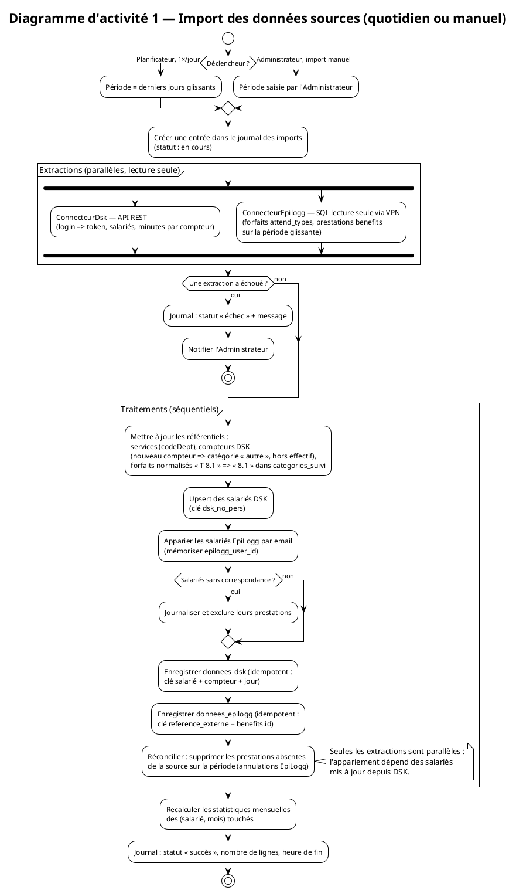

```plantuml
@startuml
!theme plain
skinparam activityShape roundBox
title Diagramme d'activité 1 — Import des données sources (quotidien ou manuel)

start
if (Déclencheur ?) then (Planificateur, 1×/jour)
  :Période = derniers jours glissants;
else (Administrateur, import manuel)
  :Période saisie par l'Administrateur;
endif

:Créer une entrée dans le journal des imports\n(statut : en cours);

partition "Extractions (parallèles, lecture seule)" {
  fork
    :ConnecteurDsk — API REST\n(login => token, salariés, minutes par compteur);
  fork again
    :ConnecteurEpilogg — SQL lecture seule via VPN\n(forfaits attend_types, prestations benefits\nsur la période glissante);
  end fork
}

if (Une extraction a échoué ?) then (oui)
  :Journal : statut « échec » + message;
  :Notifier l'Administrateur;
  stop
else (non)
endif

partition "Traitements (séquentiels)" {
  :Mettre à jour les référentiels :\nservices (codeDept), compteurs DSK\n(nouveau compteur => catégorie « autre », hors effectif),\nforfaits normalisés « T 8.1 » => « 8.1 » dans categories_suivi;
  :Upsert des salariés DSK\n(clé dsk_no_pers);
  :Apparier les salariés EpiLogg par email\n(mémoriser epilogg_user_id);
  if (Salariés sans correspondance ?) then (oui)
    :Journaliser et exclure leurs prestations;
  else (non)
  endif
  :Enregistrer donnees_dsk (idempotent :\nclé salarié + compteur + jour);
  :Enregistrer donnees_epilogg (idempotent :\nclé reference_externe = benefits.id);
  :Réconcilier : supprimer les prestations absentes\nde la source sur la période (annulations EpiLogg);
}

note right
  Seules les extractions sont parallèles :
  l'appariement dépend des salariés
  mis à jour depuis DSK.
end note

:Recalculer les statistiques mensuelles\ndes (salarié, mois) touchés;
:Journal : statut « succès », nombre de lignes, heure de fin;

stop
@enduml
```
