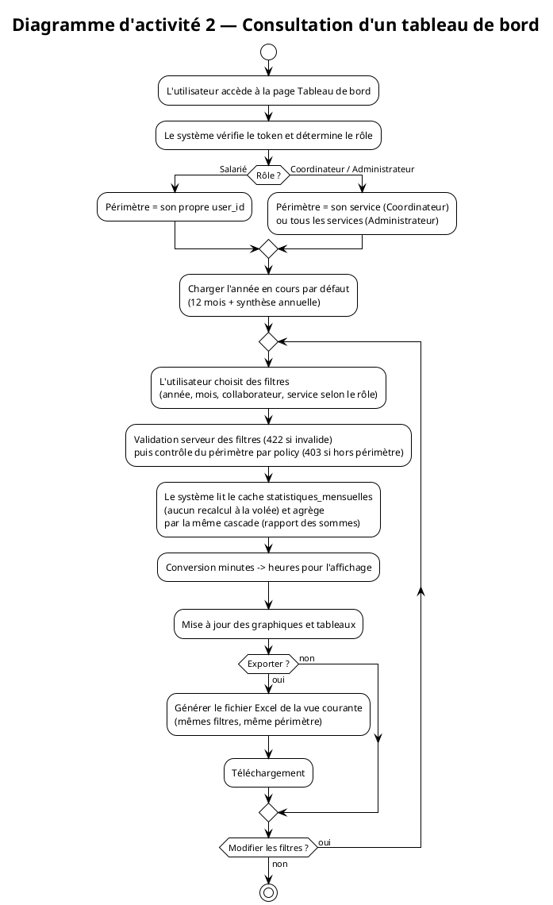

```plantuml
@startuml
!theme plain
title Diagramme d'activité 2 — Consultation d'un tableau de bord

start
:L'utilisateur accède à la page Tableau de bord;
:Le système vérifie le token et détermine le rôle;

if (Rôle ?) then (Salarié)
  :Périmètre = son propre user_id;
else (Coordinateur / Administrateur)
  :Périmètre = son service (Coordinateur)\nou tous les services (Administrateur);
endif

:Charger l'année en cours par défaut\n(12 mois + synthèse annuelle);

repeat
  :L'utilisateur choisit des filtres\n(année, mois, collaborateur, service selon le rôle);
  :Validation serveur des filtres (422 si invalide)\npuis contrôle du périmètre par policy (403 si hors périmètre);
  :Le système lit le cache statistiques_mensuelles\n(aucun recalcul à la volée) et agrège\npar la même cascade (rapport des sommes);
  :Conversion minutes -> heures pour l'affichage;
  :Mise à jour des graphiques et tableaux;

  if (Exporter ?) then (oui)
    :Générer le fichier Excel de la vue courante\n(mêmes filtres, même périmètre);
    :Téléchargement;
  else (non)
  endif

repeat while (Modifier les filtres ?) is (oui) not (non)
stop
@enduml
```
