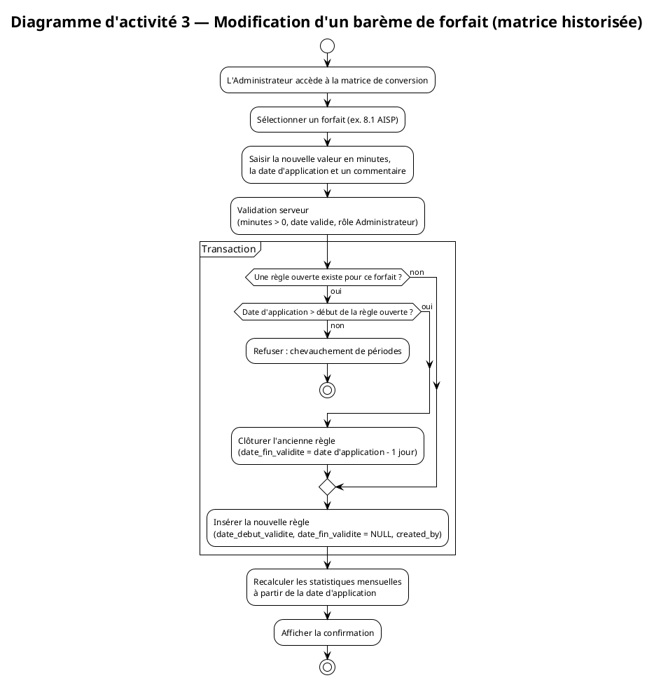

```plantuml
@startuml
!theme plain
title Diagramme d'activité 3 — Modification d'un barème de forfait (matrice historisée)

start
:L'Administrateur accède à la matrice de conversion;
:Sélectionner un forfait (ex. 8.1 AISP);
:Saisir la nouvelle valeur en minutes,\nla date d'application et un commentaire;

:Validation serveur\n(minutes > 0, date valide, rôle Administrateur);

partition "Transaction" {
  if (Une règle ouverte existe pour ce forfait ?) then (oui)
    if (Date d'application > début de la règle ouverte ?) then (non)
      :Refuser : chevauchement de périodes;
      stop
    else (oui)
    endif
    :Clôturer l'ancienne règle\n(date_fin_validite = date d'application - 1 jour);
  else (non)
  endif

  :Insérer la nouvelle règle\n(date_debut_validite, date_fin_validite = NULL, created_by);
}

:Recalculer les statistiques mensuelles\nà partir de la date d'application;
:Afficher la confirmation;

stop
@enduml
```
