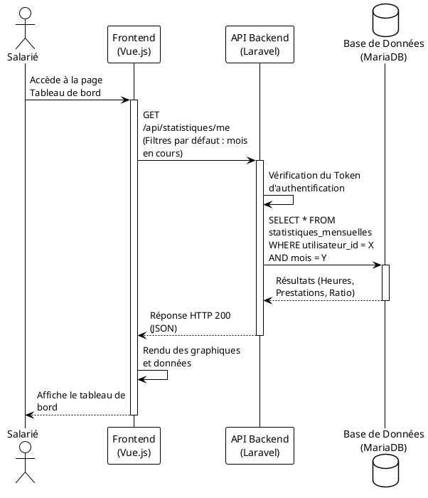

```plantuml
@startuml
!theme plain
skinparam maxMessageSize 150

actor "Salarié" as sal
participant "Frontend\n(Vue.js)" as vue
participant "API Backend\n(Laravel)" as api
database "Base de Données\n(MariaDB)" as db

sal -> vue : Accède à la page Tableau de bord
activate vue

vue -> api : GET /api/statistiques/me\n(Filtres par défaut : mois en cours)
activate api

api -> api : Vérification du Token d'authentification

api -> db : SELECT * FROM statistiques_mensuelles\nWHERE utilisateur_id = X AND mois = Y
activate db
db --> api : Résultats (Heures, Prestations, Ratio)
deactivate db

api --> vue : Réponse HTTP 200 (JSON)
deactivate api

vue -> vue : Rendu des graphiques et données
vue --> sal : Affiche le tableau de bord
deactivate vue
@enduml
```