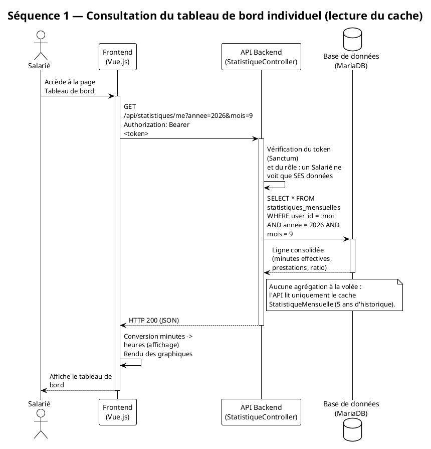

```plantuml
@startuml
!theme plain
skinparam maxMessageSize 150

title Séquence 1 — Consultation du tableau de bord individuel (lecture du cache)

actor "Salarié" as sal
participant "Frontend\n(Vue.js)" as vue
participant "API Backend\n(StatistiqueController)" as api
database "Base de données\n(MariaDB)" as db

sal -> vue : Accède à la page Tableau de bord
activate vue

vue -> api : GET /api/statistiques/me?annee=2026&mois=9\nAuthorization: Bearer <token>
activate api

api -> api : Vérification du token (Sanctum)\net du rôle : un Salarié ne voit que SES données

api -> db : SELECT * FROM statistiques_mensuelles\nWHERE user_id = :moi AND annee = 2026 AND mois = 9
activate db
db --> api : Ligne consolidée (minutes effectives, prestations, ratio)
deactivate db

note right of api
  Aucune agrégation à la volée :
  l'API lit uniquement le cache
  StatistiqueMensuelle (5 ans d'historique).
end note

api --> vue : HTTP 200 (JSON)
deactivate api

vue -> vue : Conversion minutes -> heures (affichage)\nRendu des graphiques
vue --> sal : Affiche le tableau de bord
deactivate vue
@enduml
```
