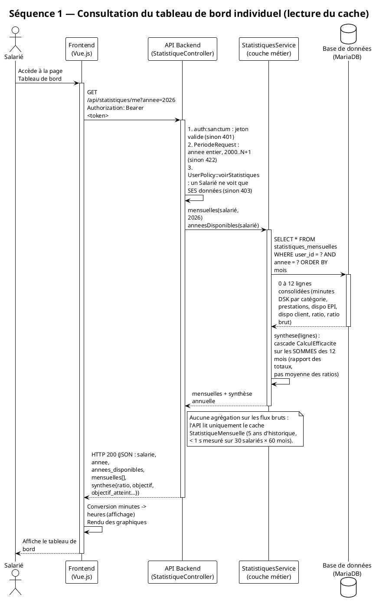

```plantuml
@startuml
!theme plain
skinparam maxMessageSize 150

title Séquence 1 — Consultation du tableau de bord individuel (lecture du cache)

actor "Salarié" as sal
participant "Frontend\n(Vue.js)" as vue
participant "API Backend\n(StatistiqueController)" as api
participant "StatistiquesService\n(couche métier)" as svc
database "Base de données\n(MariaDB)" as db

sal -> vue : Accède à la page Tableau de bord
activate vue

vue -> api : GET /api/statistiques/me?annee=2026\nAuthorization: Bearer <token>
activate api

api -> api : 1. auth:sanctum : jeton valide (sinon 401)\n2. PeriodeRequest : annee entier, 2000..N+1 (sinon 422)\n3. UserPolicy::voirStatistiques : un Salarié ne voit que SES données (sinon 403)

api -> svc : mensuelles(salarié, 2026)\nanneesDisponibles(salarié)
activate svc
svc -> db : SELECT * FROM statistiques_mensuelles\nWHERE user_id = ? AND annee = ? ORDER BY mois
activate db
db --> svc : 0 à 12 lignes consolidées (minutes DSK par catégorie,\nprestations, dispo EPI, dispo client, ratio, ratio brut)
deactivate db
svc -> svc : synthese(lignes) : cascade CalculEfficacite\nsur les SOMMES des 12 mois (rapport des totaux,\npas moyenne des ratios)
svc --> api : mensuelles + synthèse annuelle
deactivate svc

note right of api
  Aucune agrégation sur les flux bruts :
  l'API lit uniquement le cache
  StatistiqueMensuelle (5 ans d'historique,
  < 1 s mesuré sur 30 salariés × 60 mois).
end note

api --> vue : HTTP 200 (JSON : salarie, annee, annees_disponibles,\nmensuelles[], synthese{ratio, objectif, objectif_atteint…})
deactivate api

vue -> vue : Conversion minutes -> heures (affichage)\nRendu des graphiques
vue --> sal : Affiche le tableau de bord
deactivate vue
@enduml
```
