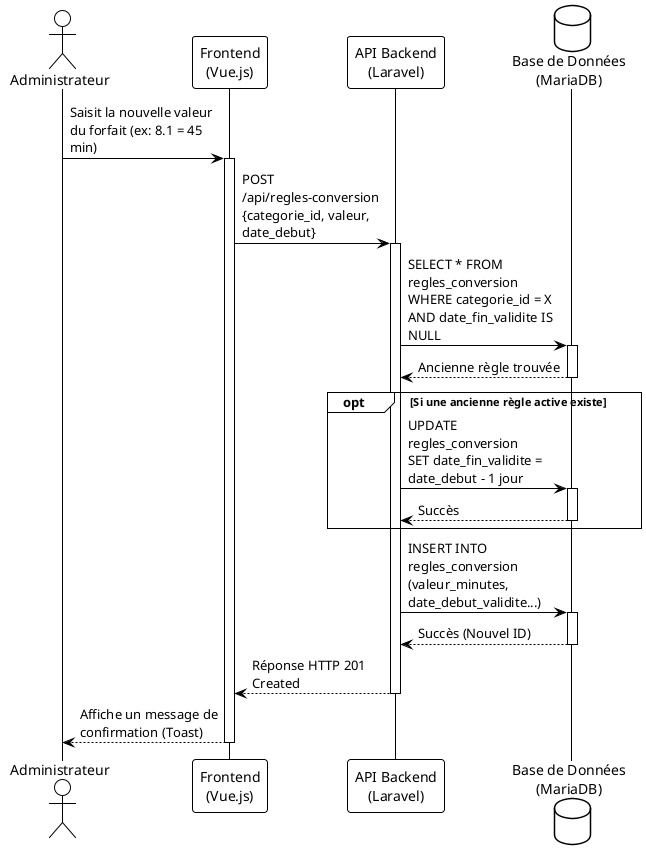

```plantuml
@startuml
!theme plain
skinparam maxMessageSize 150

actor "Administrateur" as admin
participant "Frontend\n(Vue.js)" as vue
participant "API Backend\n(Laravel)" as api
database "Base de Données\n(MariaDB)" as db

admin -> vue : Saisit la nouvelle valeur du forfait (ex: 8.1 = 45 min)
activate vue

vue -> api : POST /api/regles-conversion\n{categorie_id, valeur, date_debut}
activate api

api -> db : SELECT * FROM regles_conversion\nWHERE categorie_id = X AND date_fin_validite IS NULL
activate db
db --> api : Ancienne règle trouvée
deactivate db

opt Si une ancienne règle active existe
    api -> db : UPDATE regles_conversion\nSET date_fin_validite = date_debut - 1 jour
    activate db
    db --> api : Succès
    deactivate db
end

api -> db : INSERT INTO regles_conversion\n(valeur_minutes, date_debut_validite...)
activate db
db --> api : Succès (Nouvel ID)
deactivate db

api --> vue : Réponse HTTP 201 Created
deactivate api

vue --> admin : Affiche un message de confirmation (Toast)
deactivate vue
@enduml
```