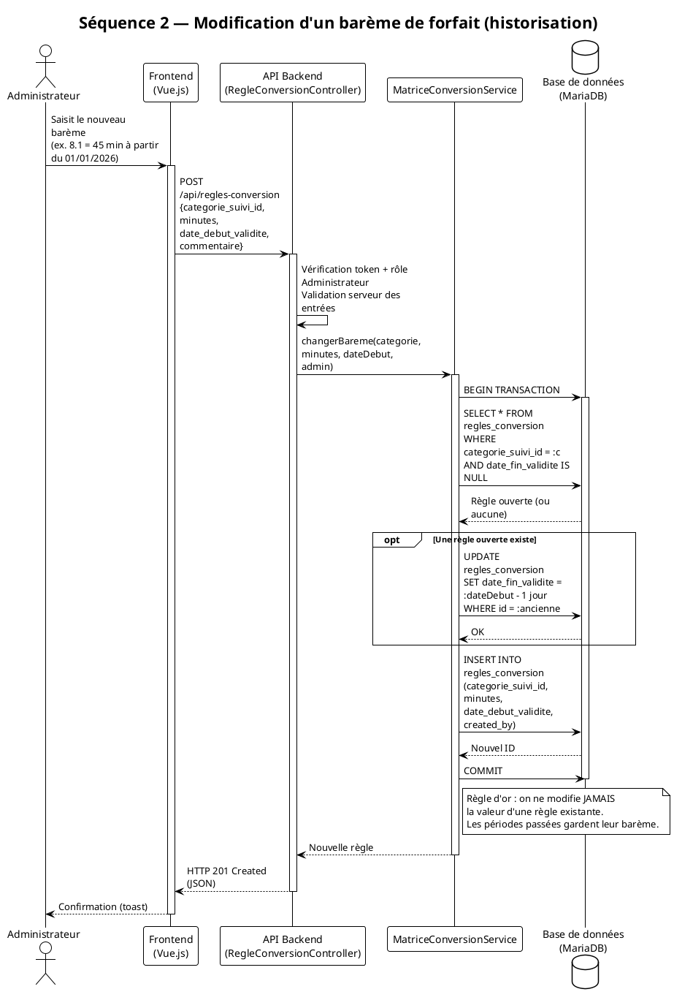

```plantuml
@startuml
!theme plain
skinparam maxMessageSize 150

title Séquence 2 — Modification d'un barème de forfait (historisation)

actor "Administrateur" as admin
participant "Frontend\n(Vue.js)" as vue
participant "API Backend\n(RegleConversionController)" as api
participant "MatriceConversionService" as service
database "Base de données\n(MariaDB)" as db

admin -> vue : Saisit le nouveau barème\n(ex. 8.1 = 45 min à partir du 01/01/2026)
activate vue

vue -> api : POST /api/regles-conversion\n{categorie_suivi_id, minutes, date_debut_validite, commentaire}
activate api

api -> api : Vérification token + rôle Administrateur\nValidation serveur des entrées

api -> service : changerBareme(categorie, minutes, dateDebut, admin)
activate service

service -> db : BEGIN TRANSACTION
activate db

service -> db : SELECT * FROM regles_conversion\nWHERE categorie_suivi_id = :c AND date_fin_validite IS NULL
db --> service : Règle ouverte (ou aucune)

opt Une règle ouverte existe
    service -> db : UPDATE regles_conversion\nSET date_fin_validite = :dateDebut - 1 jour\nWHERE id = :ancienne
    db --> service : OK
end

service -> db : INSERT INTO regles_conversion\n(categorie_suivi_id, minutes, date_debut_validite, created_by)
db --> service : Nouvel ID

service -> db : COMMIT
deactivate db

note right of service
  Règle d'or : on ne modifie JAMAIS
  la valeur d'une règle existante.
  Les périodes passées gardent leur barème.
end note

service --> api : Nouvelle règle
deactivate service

api --> vue : HTTP 201 Created (JSON)
deactivate api

vue --> admin : Confirmation (toast)
deactivate vue
@enduml
```
