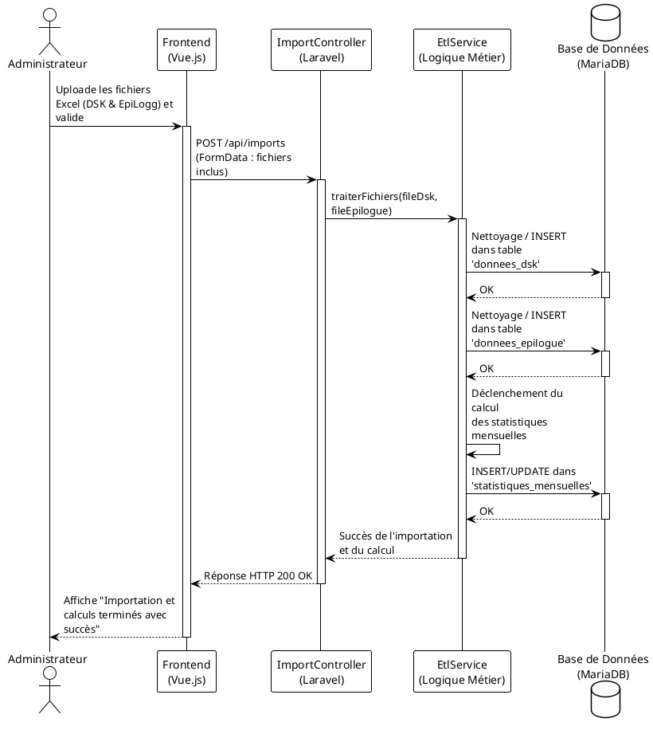

```plantuml
@startuml
!theme plain
skinparam maxMessageSize 150

actor "Administrateur" as admin
participant "Frontend\n(Vue.js)" as vue
participant "ImportController\n(Laravel)" as ctrl
participant "EtlService\n(Logique Métier)" as service
database "Base de Données\n(MariaDB)" as db

admin -> vue : Uploade les fichiers Excel (DSK & EpiLogg) et valide
activate vue

vue -> ctrl : POST /api/imports (FormData : fichiers inclus)
activate ctrl

ctrl -> service : traiterFichiers(fileDsk, fileEpilogue)
activate service

service -> db : Nettoyage / INSERT dans table 'donnees_dsk'
activate db
db --> service : OK
deactivate db

service -> db : Nettoyage / INSERT dans table 'donnees_epilogue'
activate db
db --> service : OK
deactivate db

service -> service : Déclenchement du calcul\ndes statistiques mensuelles
service -> db : INSERT/UPDATE dans 'statistiques_mensuelles'
activate db
db --> service : OK
deactivate db

service --> ctrl : Succès de l'importation et du calcul
deactivate service

ctrl --> vue : Réponse HTTP 200 OK
deactivate ctrl

vue --> admin : Affiche "Importation et calculs terminés avec succès"
deactivate vue
@enduml
```