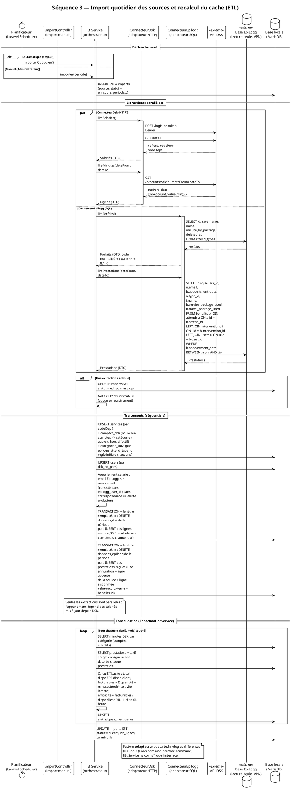

```plantuml
@startuml
!theme plain
skinparam maxMessageSize 160

title Séquence 3 — Import quotidien des sources et recalcul du cache (ETL)

control "Planificateur\n(Laravel Scheduler)" as cron
participant "ImportController\n(import manuel)" as ctrl
participant "EtlService\n(orchestrateur)" as etl
participant "ConnecteurDsk\n(adaptateur HTTP)" as cdsk
participant "ConnecteurEpilogg\n(adaptateur SQL)" as cepi
participant "API DSK" as dsk <<externe>>
database "Base EpiLogg\n(lecture seule, VPN)" as epidb <<externe>>
database "Base locale\n(MariaDB)" as db

== Déclenchement ==
alt Automatique (1×/jour)
    cron -> etl : importerQuotidien()
else Manuel (Administrateur)
    ctrl -> etl : importer(periode)
end
activate etl

etl -> db : INSERT INTO imports (source, statut = en_cours, periode…)

== Extractions (parallèles) ==
par ConnecteurDsk (HTTP)
    etl -> cdsk : lireSalaries()
    activate cdsk
    cdsk -> dsk : POST /login => token Bearer
    cdsk -> dsk : GET /listAll
    dsk --> cdsk : noPers, codePers, codeDept…
    cdsk --> etl : Salariés (DTO)
    etl -> cdsk : lireMinutes(dateFrom, dateTo)
    cdsk -> dsk : GET /accounts/calc/all?dateFrom&dateTo
    dsk --> cdsk : {noPers, date, [{noAccount, value(min)}]}
    cdsk --> etl : Lignes (DTO)
    deactivate cdsk
else ConnecteurEpilogg (SQL)
    etl -> cepi : lireForfaits()
    activate cepi
    cepi -> epidb : SELECT id, rate_name, name, minute_by_package, deleted_at\nFROM attend_types
    epidb --> cepi : Forfaits
    cepi --> etl : Forfaits (DTO, code normalisé « T 8.1 » => « 8.1 »)
    etl -> cepi : lirePrestations(dateFrom, dateTo)
    cepi -> epidb : SELECT b.id, b.user_id, u.email, b.appointment_date, a.type_id,\ni.name, b.service_package_used, b.travel_package_used\nFROM benefits b JOIN attends a ON a.id = b.attend_id\nLEFT JOIN interventions i ON i.id = b.intervention_id\nLEFT JOIN users u ON u.id = b.user_id\nWHERE b.appointment_date BETWEEN :from AND :to
    epidb --> cepi : Prestations
    cepi --> etl : Prestations (DTO)
    deactivate cepi
end

alt Une extraction a échoué
    etl -> db : UPDATE imports SET statut = echec, message
    etl -> etl : Notifier l'Administrateur (aucun enregistrement)
end

== Traitements (séquentiels) ==
etl -> db : UPSERT services (par codeDept)\n+ comptes_dsk (nouveaux comptes => catégorie « autre », hors effectif)\n+ categories_suivi (par epilogg_attend_type_id, règle initiale si aucune)
etl -> db : UPSERT users (par dsk_no_pers)
etl -> etl : Appariement salarié : email EpiLogg <-> users.email\n(persisté dans epilogg_user_id ; sans correspondance => alerte, exclusion)
etl -> db : TRANSACTION « fenêtre remplacée » : DELETE donnees_dsk de la période\npuis INSERT des lignes reçues (DSK recalcule ses compteurs chaque jour)
etl -> db : TRANSACTION « fenêtre remplacée » : DELETE donnees_epilogg de la période\npuis INSERT des prestations reçues (une annulation = ligne absente\nde la source = ligne supprimée ; reference_externe = benefits.id)

note over etl
  Seules les extractions sont parallèles :
  l'appariement dépend des salariés
  mis à jour depuis DSK.
end note

== Consolidation (ConsolidationService) ==
loop Pour chaque (salarié, mois) touché
    etl -> db : SELECT minutes DSK par catégorie (comptes effectifs)
    etl -> db : SELECT prestations + tarif ; règle en vigueur à la date de chaque prestation
    etl -> etl : CalculEfficacite : total, dispo EPI, dispo client,\nfacturables = Σ quantité × minutes(règle), activité interne,\nefficacité = facturables / dispo client (NULL si <= 0), brute
    etl -> db : UPSERT statistiques_mensuelles
end

etl -> db : UPDATE imports SET statut = succes, nb_lignes, termine_le
deactivate etl

note over cdsk, cepi
  Pattern **Adaptateur** : deux technologies différentes
  (HTTP / SQL) derrière une interface commune ;
  l'EtlService ne connaît que l'interface.
end note

@enduml
```
